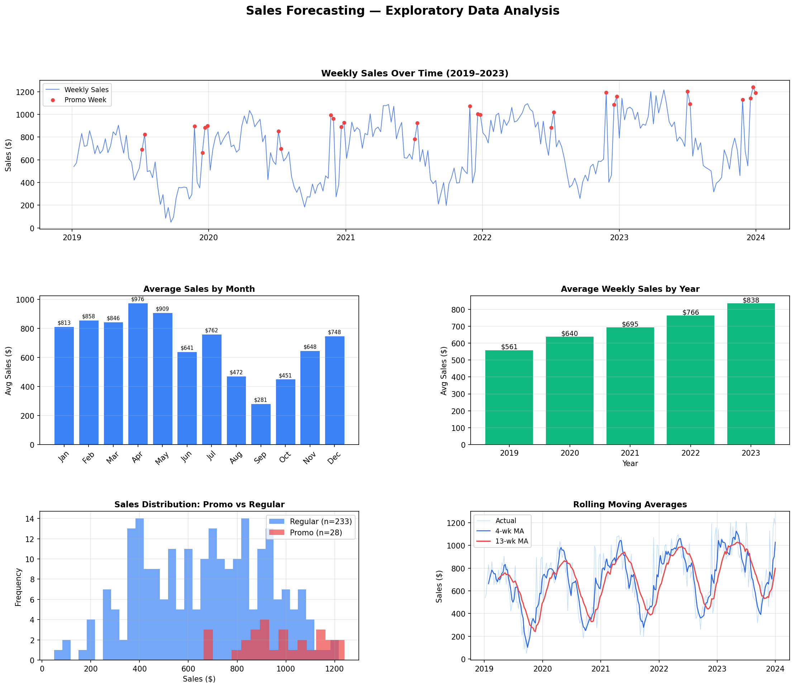
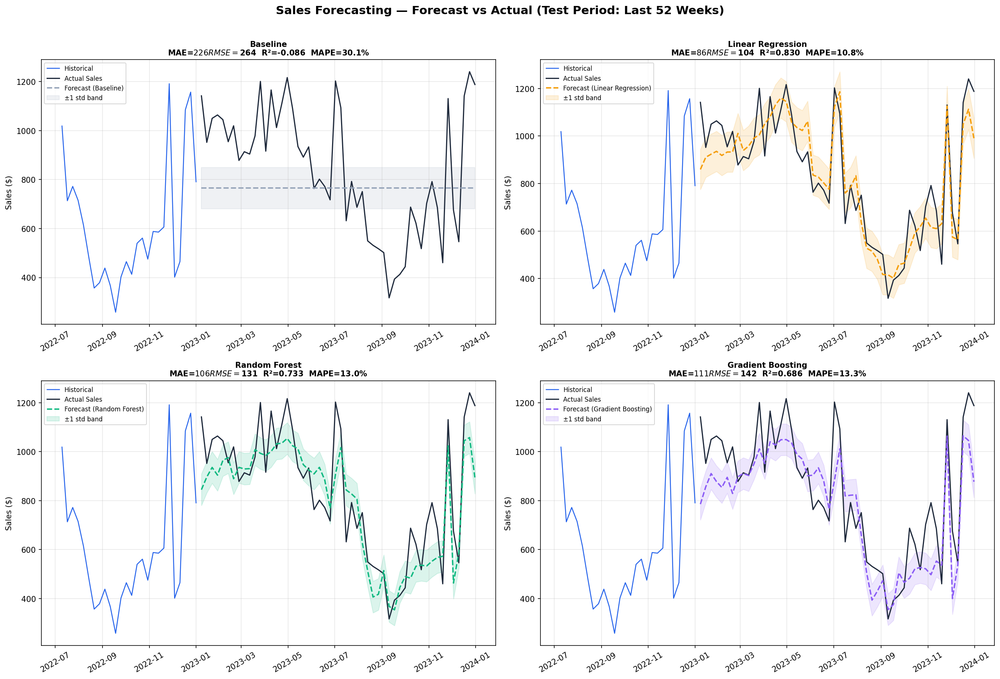
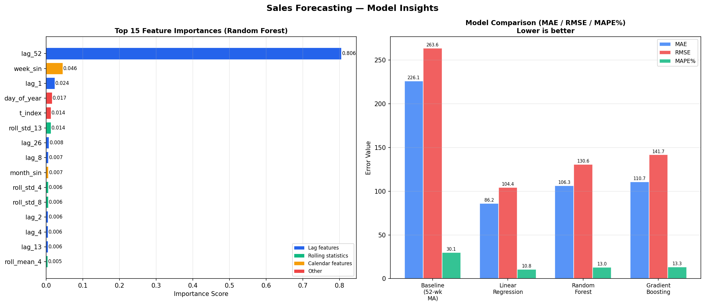
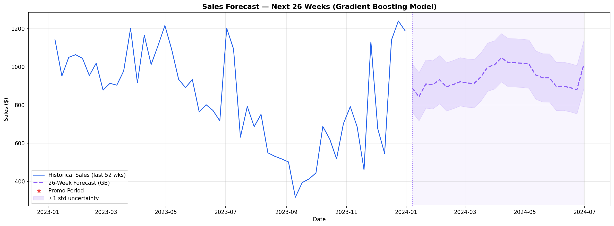

# Sales Forecasting

Predicting future retail sales using machine learning on weekly time-series data.

## Models Used
- Baseline (52-week Moving Average)
- Linear Regression
- Random Forest
- Gradient Boosting

## Results
| Model | MAE | RMSE | R² | MAPE |
|---|---|---|---|---|
| Baseline | $226 | $264 | -0.09 | 30.1% |
| Linear Regression | $86 | $104 | 0.83 | 10.8% |
| Random Forest | $106 | $131 | 0.73 | 13.0% |
| Gradient Boosting | $111 | $142 | 0.69 | 13.3% |

## Tech Stack
Python, pandas, scikit-learn, matplotlib, seaborn

## Visualizations

## How to Run
pip install pandas numpy matplotlib seaborn scikit-learn
python sales_forecasting.py
